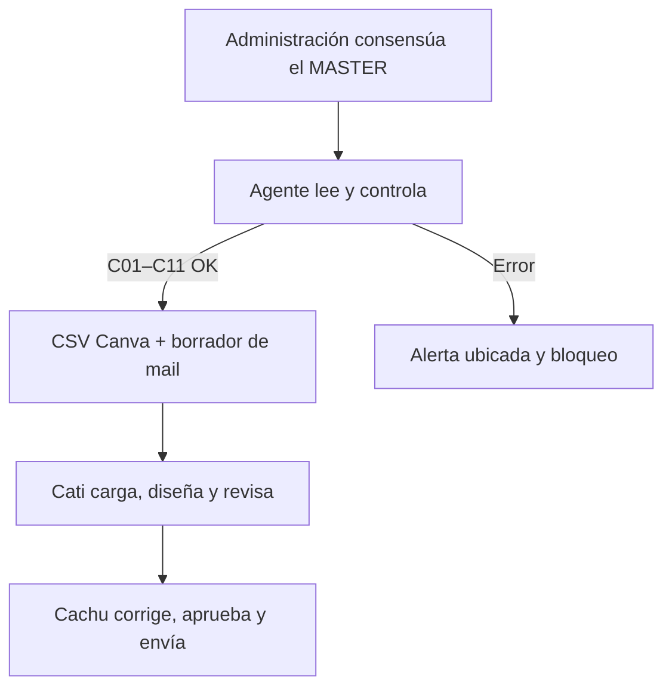

# Agente de preparación y control del informe mensual Ganadero

## Resultado

Este repositorio implementa y documenta un agente que transforma el MASTER mensual en dos artefactos revisables:

1. un CSV de una sola fila para **Canva Crear en lote**;
2. un borrador del mail que acompaña el informe Ganadero.

Opcionalmente, el mismo comando puede someter el borrador a una revisión generativa estructurada. Esa revisión no cambia los datos fuente, no libera el informe y no reemplaza la firma de Cachu.

El objetivo es reducir errores del traspaso manual: números mal copiados, fechas o auditorías desactualizadas, datos omitidos y diferencias entre el MASTER y el PDF.

El agente no modifica el MASTER, no aprueba cifras, no termina el diseño y no envía correos. Cati revisa el diseño y Cachu realiza la corrección final, aprueba y envía. El máximo nivel de autonomía es **L1**.

La entrega pública está anonimizada. No contiene el MASTER, el PDF para inversores, marcas, destinatarios ni nombres reales de fondos o establecimientos.

## Flujo operativo



El flujo conserva dos decisiones humanas distintas:

- **Cati** compara la salida de Canva contra el MASTER, cambia la fotografía y resuelve ajustes visuales.
- **Cachu** realiza el control fino final del informe y del mail. Solo él libera y envía la comunicación.

## Mapa de evidencias del sistema

| Dimensión | Evidencia verificable |
|---|---|
| D1 — Sistema completo | parser y runner, aplicación web, XLSX, Canva Crear en lote, JSON estricto, bloqueo y revisor opcional con límites y reintentos |
| D2 — Proceso documentado | `DECISIONES.md`, tres versiones del contrato y tres tropiezos/resultados preservados |
| D3 — Reproducibilidad | dependencias exactas, `package-lock.json`, un comando mensual y `npm test` |
| D4 — Economía | costo determinístico, escenario opcional con modelo, fórmula y proyecciones |
| D5 — Gobierno y riesgo | L0–L4, segregación Cati/Cachu, fallas, permisos y firma humana |

## Estructura

```text
.
├── README.md
├── DECISIONES.md
├── app/
│   └── page.tsx
├── lib/
│   ├── ganadero-agent.mjs
│   └── model-reviewer.mjs
├── scripts/
│   └── generar-ganadero.mjs
├── prompts/
│   ├── system_prompt.md
│   ├── user_prompt.md
│   └── historial/
├── corridas/
│   ├── corrida_01_v1.json
│   ├── corrida_02_v2.json
│   ├── corrida_03_v3.json
│   └── originales/
├── validaciones/
│   └── validacion_2026_08.json
├── schemas/
│   └── output.schema.json
├── tests/
│   ├── validar_corridas.mjs
│   ├── model-reviewer.test.mjs
│   ├── sheet-read-limits.test.mjs
│   └── unicode-integrity.test.mjs
├── .env.example
├── package.json
└── package-lock.json
```

## Qué hace realmente el código

El archivo `lib/ganadero-agent.mjs` contiene el contrato operativo:

- abre el Excel con `xlsx` en modo de lectura;
- encuentra la hoja de resumen por su nombre normalizado;
- detecta el período dentro del libro y no desde el nombre del archivo;
- identifica el fondo operativo por encabezados y valores numéricos;
- encuentra el bloque de provincias desde la fórmula `SUM(...)`, por lo que una columna desplazada no rompe el control;
- reconcilia cabezas físicas, compras a término y cabezas totales;
- localiza la serie de rentabilidad que coincide con el importe del resumen;
- lee portfolio, composición de hacienda, establecimientos y precios del mismo período;
- completa C01–C11;
- limita cada hoja a 5.000 filas y 256 columnas para que un formato residual hasta el final de Excel no agote memoria;
- genera 126 campos con el formato exacto del template;
- deja realmente vacíos los meses futuros y conserva sus encabezados para el template Canva ya vinculado;
- prepara el mail solo cuando no existen controles bloqueantes.

La aplicación `app/page.tsx` expone el mismo flujo en una interfaz: cargar MASTER, revisar controles, descargar CSV y copiar mail. No existe un botón de envío.

`lib/model-reviewer.mjs` implementa una revisión opcional mediante Responses API. Usa salida estructurada con JSON Schema estricto, una sola iteración de modelo, máximo de 1.000 tokens de salida, entrada limitada a 20.000 caracteres, `timeout` de 30 segundos y hasta tres intentos HTTP. Solo reintenta 429/503; respeta `Retry-After` y, si no está disponible, aplica backoff exponencial con jitter y un límite total de tiempo.

## Herramientas reales

| Herramienta | Uso real | Nivel |
|---|---|---:|
| Lector `xlsx` | abre el MASTER y extrae valores, fechas y fórmulas | L0 |
| Canva Crear en lote | vincula los campos del CSV al template y genera la copia mensual | L1 con revisión |
| Validador Node | comprueba corridas, controles, estados y valores clave | L0 |
| Responses API, opcional | revisa la coherencia del borrador y devuelve JSON cerrado | L1 con revisión de Cachu |

Canva no se invoca por API. Cati carga el CSV mediante la función Crear en lote. Esta restricción mantiene la herramienta dentro del acceso disponible en Canva Educación y preserva la revisión visual antes de generar el PDF.

## Contrato de seis piezas

| Pieza | Ubicación |
|---|---|
| Rol | `prompts/system_prompt.md`, sección 1 |
| Contexto | sección 2 |
| Tarea | sección 3 |
| Restricciones | sección 4 |
| Formato | sección 5 y `schemas/output.schema.json` |
| Ejemplos | sección 7 |
| Pedido puntual | `prompts/user_prompt.md` |

La salida tiene cinco claves raíz estables: `identificacion`, `checklist`, `alertas`, `artefactos` y `supervision`.

## Controles C01–C11

| ID | Control | Bloquea cuando |
|---|---|---|
| C01 | MASTER legible | el archivo no abre o excede los límites |
| C02 | Período identificado | no existe una fecha de cierre inequívoca |
| C03 | Fondo Ganadero identificado | la fila operativa es ambigua |
| C04 | Indicadores completos | falta fondos, CP o rentabilidad |
| C05 | Total provincial | la suma de provincias no coincide con el total físico |
| C06 | Total de hacienda | físicas + compras a término no coincide con el total |
| C07 | Serie mensual | no existe el período en rentabilidad |
| C08 | Portfolio | falta el período o una categoría requerida |
| C09 | Hacienda y establecimientos | no concilian sexo, categorías o stock |
| C10 | Precios | falta alguna de las series del período |
| C11 | Auditoría y formato Canva | la auditoría es inválida o el dataset no es utilizable |

Ante un error, los artefactos quedan `BLOQUEADO`, sus contenidos utilizables son `null` y el control indica qué debe revisar Cati.

## Tres corridas reales

Las tres corridas usan el mismo MASTER de julio para aislar el efecto del cambio, no para aparentar tres casos distintos.

| Corrida | Entrada y herramienta | Resultado observado | Métrica |
|---|---|---|---:|
| 1 — v1 | MASTER → archivo `.xlsx` → Canva | Canva rechazó el formato | 0 campos detectados |
| 2 — v2 | MASTER → CSV → template original | el CSV abrió, pero las tablas no aceptaron vínculos estables | 9 de 85 coincidencias automáticas |
| 3 — v3 | MASTER → CSV → cuadros de texto | informe de ocho páginas y mail listos para revisión | 126 campos; 0 diferencias |

La corrida final validó, entre otros controles:

- 4.818 cabezas físicas + 136 compras a término = 4.954 totales;
- auditoría al 30/06/2026;
- 126 de 126 campos iguales al CSV que generó el PDF revisado;
- junio completo y agosto–diciembre vacíos;
- ocho páginas revisadas.

Los JSON incluyen fecha, entrada anonimizada, métricas, controles, salida y responsables. Cada uno incorpora una traza estructurada con `timestamp`, `request`, `response` y `usage`. Los nombres de parámetros y variables coinciden literalmente con `prompts/user_prompt.md`; como el runner principal no invoca un modelo, `model_invocations`, `input_tokens` y `output_tokens` valen cero. `corridas/originales/` conserva los mensajes visibles y el resultado de cada prueba. El hash SHA-256 del MASTER real permite demostrar que las tres corridas usaron la misma entrada sin publicar el archivo.

## Validación fuera de muestra

Después de cerrar las tres iteraciones se ejecutó el agente con el MASTER del mes siguiente, sin adaptar posiciones ni cifras a mano. El libro contenía cierre **31/08/2026** aunque su nombre refería a septiembre, y el agente tomó correctamente la fecha interna.

Resultado: 11 de 11 controles en `OK`, 126 campos Canva, meses futuros vacíos, fecha de auditoría al 30/06/2026 y CSV/mail en `LISTO_PARA_REVISION`. También se comprobaron revisiones retroactivas en meses del año en curso, que el agente trasladó desde el nuevo MASTER en lugar de conservar cifras del PDF anterior.

La prueba reveló una hoja cuyo formato residual extendía el rango declarado hasta la fila 1.048.573. Se incorporó una lectura acotada y una prueba de regresión para evitar bloqueos de memoria sin recortar las columnas útiles. La evidencia pública, sin cifras ni nombres sensibles, está en `validaciones/validacion_2026_08.json`.

## Reproducir y ejecutar

Requisitos: Node.js 22 o superior.

### Instalación inicial

```bash
npm ci
```

Las versiones están fijadas exactamente en `package.json`; `package-lock.json` fija además cada dependencia transitiva.

### Comando mensual único

```bash
npm run generar -- --master "/ruta/al/MASTER.xlsx" --salida "salidas/2026-08"
```

Opcionalmente se puede confirmar una fecha de auditoría:

```bash
npm run generar -- --master "/ruta/al/MASTER.xlsx" --auditoria 2026-06-30 --salida "salidas/2026-08"
```

### Revisión generativa opcional

Copiar `.env.example` fuera del repositorio o definir las variables en la terminal, sin escribir la clave en GitHub. Después ejecutar el mismo comando con una bandera adicional:

```bash
OPENAI_API_KEY="..." npm run generar -- --master "/ruta/al/MASTER.xlsx" --salida "salidas/2026-08" --revisar-con-modelo
```

Este modo agrega `revision_modelo.json`. La clave queda en el entorno y nunca se incluye en las salidas. El modelo recibe solamente el checklist, los indicadores necesarios y el borrador; no recibe el Excel, las hojas completas ni los nombres de establecimientos. La implementación sigue la [salida estructurada](https://developers.openai.com/api/docs/guides/structured-outputs) y la guía oficial de [límites y reintentos](https://developers.openai.com/api/docs/guides/rate-limits).

El comando escribe tres archivos:

- `resultado.json`: controles, alertas, artefactos y supervisión;
- `carga_canva_ganadero.csv`: única fila para Canva Crear en lote;
- `mail_ganadero.txt`: borrador para que revise Cachu.

### Validar la entrega

```bash
npm test
```

Este comando no necesita el MASTER confidencial. Valida las tres corridas, las tres salidas originales, sus trazas `request/response/usage`, todos los parámetros del prompt, C01–C11, estados, anonimización y los 126 campos de la corrida final. También comprueba que los meses futuros estén realmente vacíos, que no existan caracteres de formato ocultos ni controles bidireccionales, que el revisor distinga reintentos 429/503 y que la lectura de hojas respete el límite defensivo.

## Uso mensual por el equipo

1. Administración consensúa el MASTER y lo comparte.
2. Cati carga el archivo en la página o ejecuta el comando mensual.
3. Si C01–C11 pasan, descarga el CSV.
4. En el template de Canva abre **Apps → Crear en lote → Subí los datos**.
5. Vincula o reutiliza los campos ya vinculados y genera una sola copia.
6. Cambia la fotografía y revisa cada valor contra el MASTER.
7. Exporta el PDF y lo entrega a Cachu junto con el borrador.
8. Cachu corrige, aprueba, adjunta y envía manualmente.

## Análisis económico

### Arquitectura elegida

La extracción, los controles y el formato son determinísticos. Por eso la ejecución predeterminada no llama a un modelo y su costo marginal de tokens es **USD 0**. Esta decisión reduce variabilidad y evita enviar el MASTER a un proveedor externo.

El contrato también permite una revisión generativa opcional del mail. Para ese caso se elige `gpt-5.6-luna`, el modelo suficiente más pequeño para una tarea cerrada con datos ya estructurados, plantilla y revisión humana.

Precios estándar de contexto corto consultados el 11/09/2026 en la [documentación oficial de OpenAI](https://developers.openai.com/api/docs/pricing): USD 0,20 por millón de tokens de entrada y USD 1,20 por millón de tokens de salida.

### Fórmula del escenario opcional

`Costo = entrada / 1.000.000 × 0,20 + salida / 1.000.000 × 1,20`

Supuesto por revisión: 3.000 tokens de entrada y 1.000 de salida.

`Costo por revisión = 3.000 / 1.000.000 × 0,20 + 1.000 / 1.000.000 × 1,20 = USD 0,0018`

| Frecuencia | Costo estimado |
|---|---:|
| 0,5 revisiones por semana | USD 0,0009/semana |
| 2 revisiones por mes | USD 0,0036/mes |
| 24 revisiones por año | USD 0,0432/año |
| Sensibilidad: 10 revisiones por mes | USD 0,0180/mes |

El cálculo excluye impuestos, hosting, Canva y tiempo humano. Canva Educación ya estaba disponible para el piloto y no generó un costo incremental atribuible a la corrida.

## Gobierno L0–L4

| Acción | Nivel | Estado |
|---|---:|---|
| Leer MASTER, fechas, fórmulas y estructura | L0 | Permitida |
| Ejecutar controles y preparar CSV/mail | L1 | Permitida |
| Adoptar una estructura nueva o cambiar el template | L2 | Solo con aprobación humana |
| Modificar el MASTER o enviar el mail | L3 | Prohibida |
| Aprobar cifras, auditorías o decisiones financieras | L4 | Prohibida |

El agente no supera L1. Cati y Cachu son barreras humanas consecutivas, no reemplazables por un estado `OK` del sistema.

## Alcance negativo y limitaciones

- El agente trabaja únicamente con el informe Ganadero. Las series de otros productos se excluyeron del trabajo final.
- La fotografía y su ubicación quedan a cargo de Cati.
- Las filas históricas verdes de cierres anuales no se modifican.
- El sistema no certifica información auditada; solo presenta la fecha confirmada.
- Los nombres de establecimientos del MASTER no se publican.
- Canva sigue requiriendo la carga humana del CSV y una revisión visual.
- La revisión por modelo es opcional y no fue usada para construir las tres corridas reales; esas corridas se basan en el MASTER, el parser y pruebas reales en Canva.
- El despliegue con link y contraseña compartida es una etapa posterior. No es necesario para reproducir la entrega académica.

## Reflexión

El problema no era redactar un mail: era controlar el pasaje entre tres representaciones distintas de la misma información —Excel, Canva y correo— sin perder trazabilidad.

La primera prueba mostró que un archivo correcto puede fallar por el formato de intercambio. La segunda mostró que un CSV correcto tampoco alcanza si el template usa elementos no vinculables. La tercera resolvió ambos puntos con un contrato plano, nombres de campo estables y roles humanos explícitos.

La reducción a Ganadero fue deliberada. Permitió probar el flujo completo con un MASTER real, un template real y un PDF final revisado, en vez de documentar una automatización más amplia pero no demostrada.
